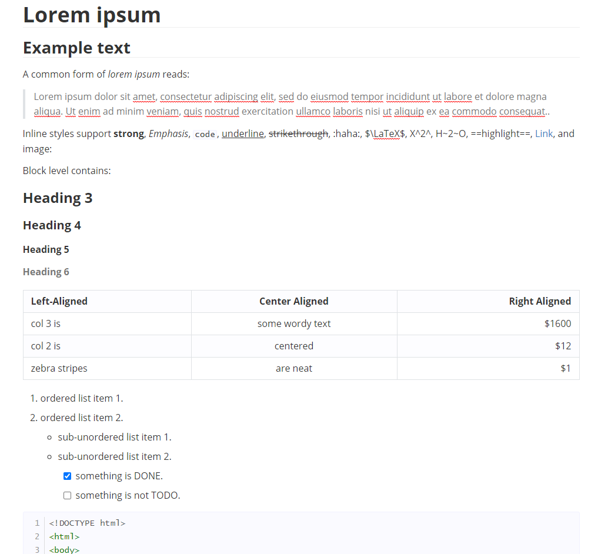

# GitBlue Theme for Typora

This theme is based on the github style, just with a blue-ish touch

## Screenshot

## Installation

1. Open Theme Folder from `Preference Panel` → `Appearance` section.
2. Copy `gitblue.css` file and `gitblue` folder into the opened folder.
3. Restart Typora, then select it from `Themes` menu.
4. Enjoy
